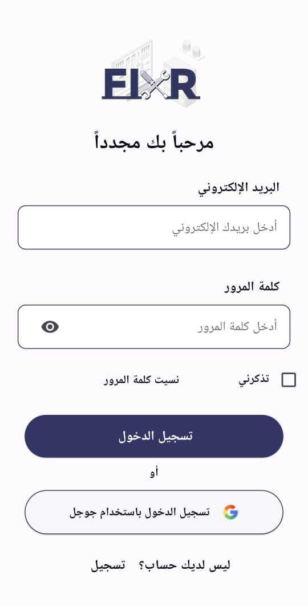
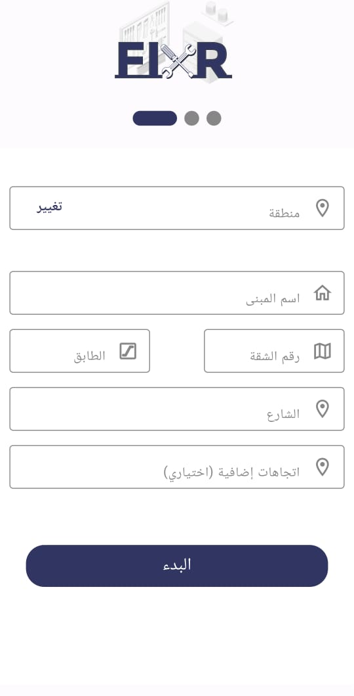

# Fixer  

## Fixer is a system primarily utilized as a mobile application, catering to individuals seeking craftsmen to address various household repair needs

## App Architecture (MVVM)

### core

is the core folder of the project which contains the main classes and interfaces that are used in the project.

### features

this section is divided into the app features and each feature is divided into two main layers:

#### data

this layer is responsible for handling the data from the network or the database.

#### presentation

this layer is responsible for handling the UI and the user interactions.

## This is a documentation of the app features in action

### 1. Splash Screen

#### A) IOS and android till 11 version

| IOS and Adroid till 11| Android 12 + |
| --- | ------- |
|  |  |

### 2. Onboarding Screen

The onboarding screens introduce the users to the application and are designed to guide user seamlessly through app features.
Each onboarding screen has an arrow button to navigate through them and also is provided with a skip button to skip through all of them to the login button.

#### First onboarding screen

| English | Arabic |
| ------- | ------ |
|  |  |

#### Second onboarding screen

| English | Arabic |
| ------- | ------ |
|  |  |

#### Third onboarding screen

| English | Arabic |
| ------- | ------ |
|  |  |

### 3. Login screen

The login screen is the first actual interaction with the user. Entering an email and password to register and have an account with the option to log in through the user's Google account.

| English | Arabic |
| ------- | ------ |
|  |  |

### 4.User Sign Up screen

This screen gives the user the option to sign up as a client or as a craftsmen. 

| English | Arabic |
| ------- | ------ |
|  |  |

### 5.Client Phone number insert screen  

When the user chooses to sign up as a client this screen appears so that the user enters his phone number to get a confirmation code sent to his phone number.

| English | Arabic |
| ------- | ------ |
|  |  |

### 6.Client Confirmation code screen

The code is sent to the client's number and is entered in this screen and the code can be resent incase of faliure.

| English | Arabic |
| ------- | ------ |
|  |  |

### 7.Cleint address screen 

The client enters his address or the place he wishes to recieve the service.

| English | Arabic |
| ------- | ------ |
|  |  |

### 8.Craftsman phone number insert screen

When the user chooses to sign up as a craftman, this screens appears to enter his phone number 

| English | Arabic |
| ------- | ------ |
|  |  |

### 9.Craftsman confirmation code screen

The code sent to the craftsman's number is entered to this screen and the code can be resent incase of faliure.

| English | Arabic |
| ------- | ------ |
|  |  |

### 10.Craftman's password screen

When the craftman confirms the code sent to him, then he navigates to the password screen to set a password the meets the requirments for security.

| English | Arabic |
| ------- | ------ |
|  |  |

### 11.Craftmen information entry form screen

After the craftman sets his password the he is navigated to a form to enter his personal information name, national Id, and the city he lives in.

| English | Arabic |
| ------- | ------ |
|  |  |

### 12.Craftemn service selection screen

Then the craftmen is navigated to this screen to select which service does he wish to provide through the app. 

| English | Arabic |
| ------- | ------ |
|  |  |

### 13.Inserting personal IDs photos screen

Them the craftsman is then navigated to this screen to enter his personal ID photo and his profile picture photo through the camera or through the mobile files. 

| English | Arabic |
| ------- | ------ |
|  |  |