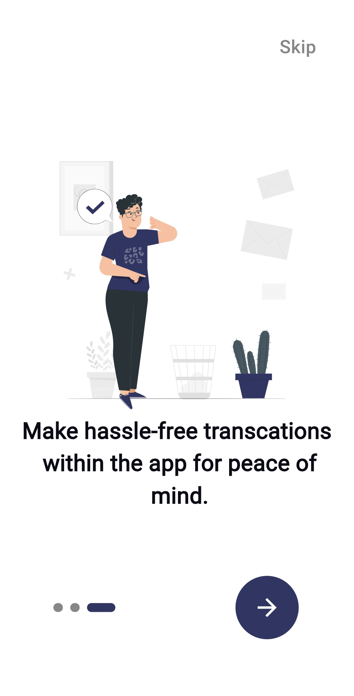
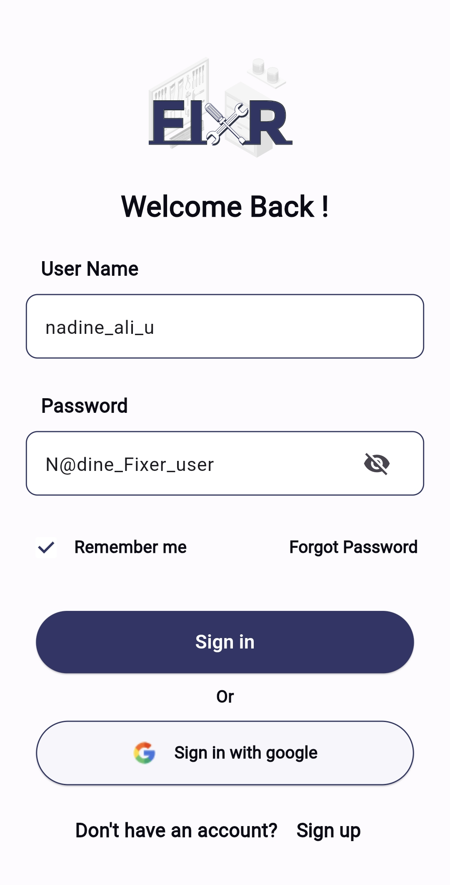

# Fixer  

## Fixer is a system primarily utilized as a mobile application, catering to individuals seeking craftsmen to address various household repair needs

## App Architecture (MVVM)

### core

is the core folder of the project which contains the main classes and interfaces that are used in the project.

### features

this section is divided into the app features and each feature is divided into two main layers:

#### data

this layer is responsible for handling the data from the network or the database.

#### presentation

this layer is responsible for handling the UI and the user interactions.

## This is a documentation of the app features in action

### 1. Splash Screen

#### A) IOS and android till 11 version

| IOS and Adroid till 11| Android 12 + |
| --- | ------- |
|  |  |

### 2. Onboarding Screen

The onboarding screens introduce the users to the application and are designed to guide user seamlessly through app features.
Each onboarding screen has an arrow button to navigate through them and also is provided with a skip button to skip through all of them to the login button.

#### First onboarding screen

| English | Arabic |
| ------- | ------ |
|  |  |

#### Second onboarding screen

| English| Arabic |
| ------- | ------ |
|  |  |

#### Third onboarding screen

| English | Arabic |
| ------- | ------ |
|  |  |

### 3. Login Screen

The login screen is the first actual interaction with the user. Entering an email and password to register and have an account with the option to log in through the user's Google account.

