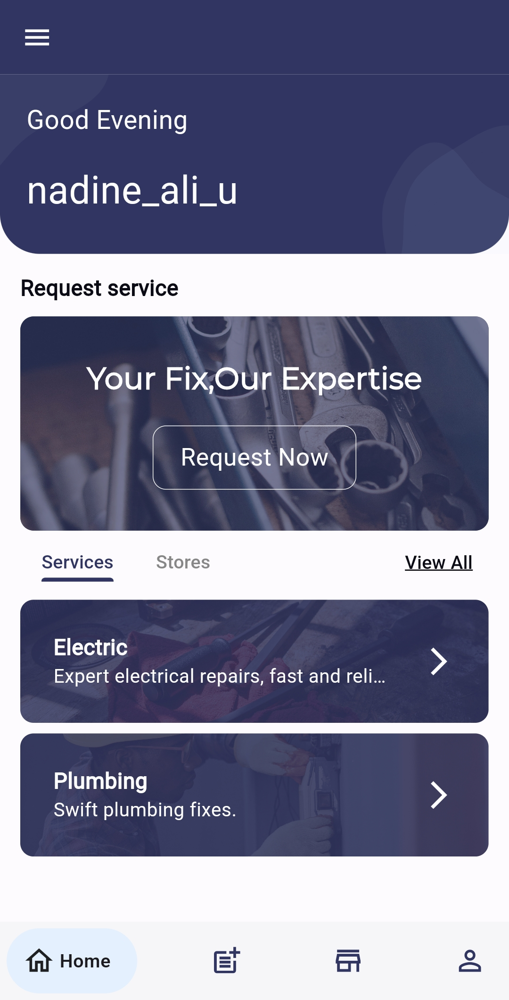
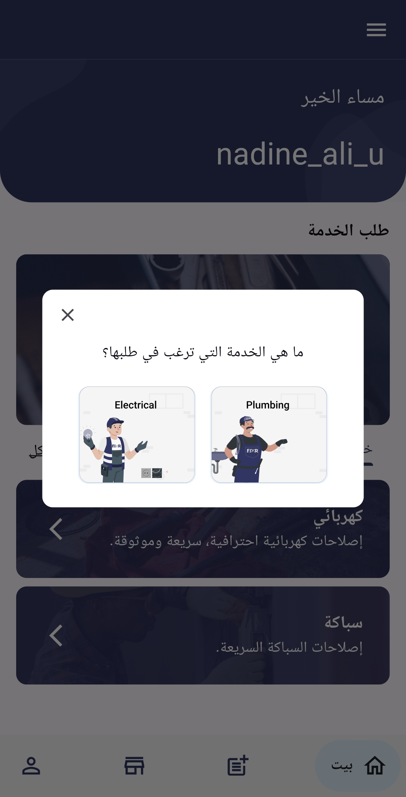
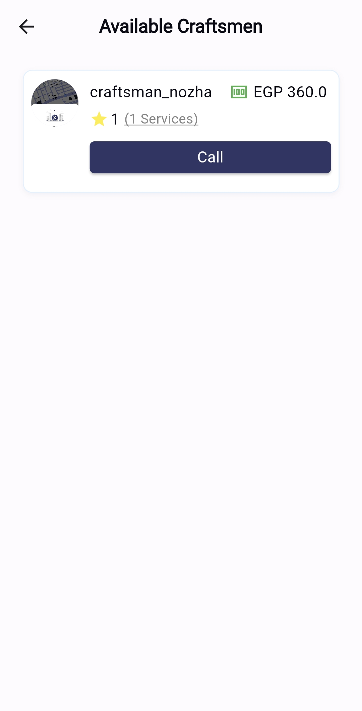
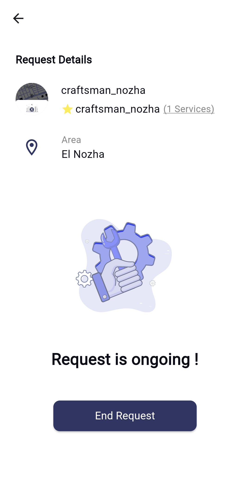
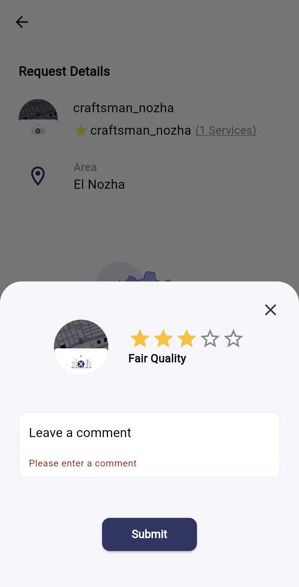
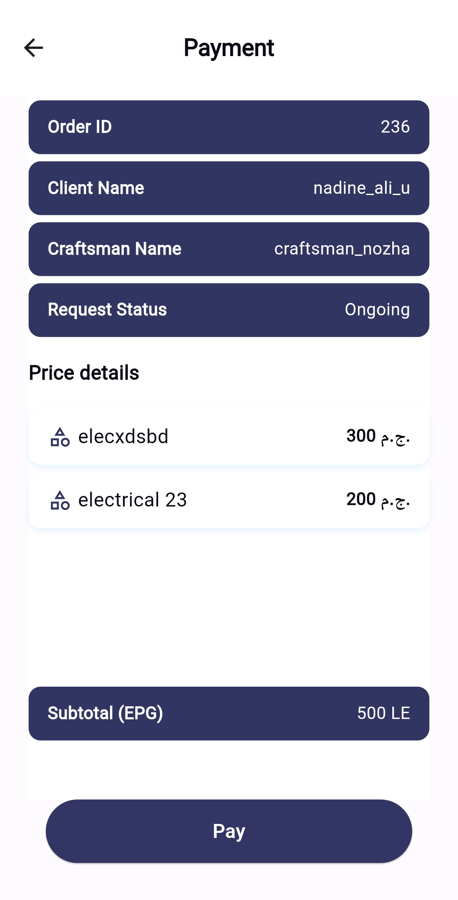
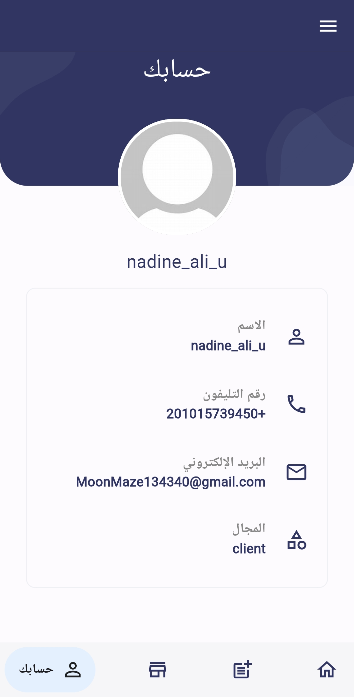
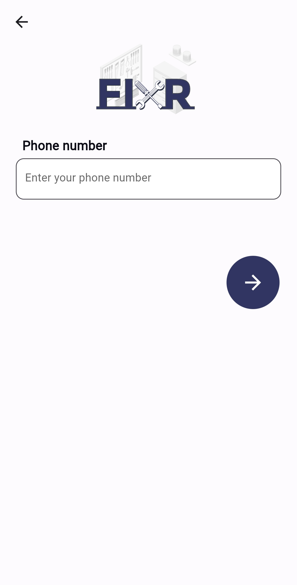

# Fixer  

## Fixer is a system primarily utilized as a mobile application, catering to individuals seeking craftsmen to address various household repair needs

## App Architecture (MVVM)

### core

is the core folder of the project which contains the main classes and interfaces that are used in the project.

### features

this section is divided into the app features and each feature is divided into two main layers:

#### data

this layer is responsible for handling the data from the network or the database.

#### presentation

this layer is responsible for handling the UI and the user interactions.

## This is a documentation of the app features in action

### 1. Splash Screen

#### A) IOS and android till 11 version

| IOS and Adroid till 11| Android 12 + |
| --- | ------- |
|  |  |

### 2. Onboarding Screen

The onboarding screens introduce the users to the application and are designed to guide user seamlessly through app features.
Each onboarding screen has an arrow button to navigate through them and also is provided with a skip button to skip through all of them to the login button.

#### First onboarding screen

| English | Arabic |
| ------- | ------ |
|  |  |

#### Second onboarding screen

| English | Arabic |
| ------- | ------ |
|  |  |

#### Third onboarding screen

| English | Arabic |
| ------- | ------ |
|  |  |

### 3. Login screen

The login screen is the first actual interaction with the user. Entering an email and password to register and have an account with the option to log in through the user's Google account.

| English | Arabic |
| ------- | ------ |
|  |  |

### 4.User Sign Up screen

This screen gives the user the option to sign up as a client or as a craftsmen. 

| English | Arabic |
| ------- | ------ |
|  |  |

### 5.client app Journey 

### 5.1.Client Phone number insert screen  

When the user chooses to sign up as a client this screen appears so that the user enters his phone number to get a confirmation code sent to his phone number.

| English | Arabic |
| ------- | ------ |
|  |  |

### 5.2.Client Confirmation code screen

The code is sent to the client's number and is entered in this screen and the code can be resent incase of faliure.

| English | Arabic |
| ------- | ------ |
|  |  |

### 5.3.client sign up form 

the client is navigated to this screen to enter his username,email and password 

| English | Arabic |
| ------- | ------ |
|  |  |

### 5.4.terms and condition screen

| English | Arabic |
| ------- | ------ |
|  |  |

### 5.5.Cleint location detail screen 

Then client enters his address details or the place he wishes to recieve the service.

| English | Arabic |
| ------- | ------ |
|  |  |

### 5.6.Clinet location on map selection screen 
| English | Arabic |
| ------- | ------ |
|  |  |

### 5.7.client homescreen

After completeing the sign up process,the cilent is then navigated to the home screen 

| English | Arabic |
| ------- | ------ |
|  |  |

### 5.8.client request process 

when teh client clicks on request now button, a pop up appears to choose between electric or plumbing category

| English | Arabic |
| ------- | ------ |
|  |  |

then the depending on his choice he is then navigated to all services available in each category 

in case of choosing electric:

| English | Arabic |
| ------- | ------ |
|  |  |

in case of choosing plumbing: 

then after selecting a service a pop up appears to confirm requesting the right service 

| English | Arabic |
| ------- | ------ |
|  |  |

then he is then navigated to the a screen that lists the location , requested services and total price of request

| English | Arabic |
| ------- | ------ |
|  |  |

if he clicks on the service than a list of all services requested will appear as bottom sheet

| English | Arabic |
| ------- | ------ |
|  |  |

after confirming the request the client is then navigated to a screen showing all the available craftsmen in his area with their ratings , prices and number of services they have done before.

| English | Arabic |
| ------- | ------ |
|  |  |

incase there are no available craftsman this meassage will appear

| English | Arabic |
| ------- | ------ |
|  |  |

incase the service is not availabe in his area this message will appear

| English | Arabic |
| ------- | ------ |
|  |  |

then he have to click on "cancel request" to return to home screen 

### 5.9.call craftman

when the user clicks confrim then he is navigated to a screen to all the craftman

| English | Arabic |
| ------- | ------ |
|  |  |

### 5.10.Ongoing service screen 

this screen appears as long as the service is still ongoing 

| English | Arabic |
| ------- | ------ |
|  |  |

### 5.11.rating craftmen screen 

after the service is done the clients rates the craftfen on his service 

| English | Arabic |
| ------- | ------ |
|  |  |

### 5.12.payment screen 

after completeing the service tha user is then navigated to the payment screen 

| English | Arabic |
| ------- | ------ |
|  |  |

| English | Arabic |
| ------- | ------ |
|  |  |

### 5.12 client request history screen 

the request icon in nav bar shows the history of ongonig or done services that the client had recieved.

| English | Arabic |
| ------- | ------ |
|  |  |

and when client clicks on order the order details screen appear

| English | Arabic |
| ------- | ------ |
|  |  |

### 5.13 stores screen 

the store icon in nav bar navigates to all available stores.

| English | Arabic |
| ------- | ------ |
|  |  |

if the client clicks on any store then a screen displaying all items in that store appears

| English | Arabic |
| ------- | ------ |
|  |  |

### 5.14 client profile 

the profile icon in nav bar navigates to profile of client

| English | Arabic |
| ------- | ------ |
|  |  |

### 6.Craftman app journey
### 6.1.Craftsman phone number insert screen

When the user chooses to sign up as a craftman, this screens appears to enter his phone number 

| English | Arabic |
| ------- | ------ |
|  |  |

### 6.2.Craftsman confirmation code screen

The code sent to the craftsman's number is entered to this screen and the code can be resent incase of faliure.

| English | Arabic |
| ------- | ------ |
|  |  |

### 6.3.Craftman's password screen

When the craftman confirms the code sent to him, then he navigates to the password screen to set a password the meets the requirments for security.

| English | Arabic |
| ------- | ------ |
|  |  |

### 6.4.Craftmen information entry form screen

After the craftman sets his password the he is navigated to a form to enter his personal information name, national Id, and the city he lives in.

| English | Arabic |
| ------- | ------ |
|  |  |

### 6.5.Craftemn service selection screen

Then the craftmen is navigated to this screen to select which service does he wish to provide through the app. 

| English | Arabic |
| ------- | ------ |
|  |  |

### 6.6.Inserting personal IDs photos screen

Then the craftsman is then navigated to this screen to enter his personal ID photo.

| English | Arabic |
| ------- | ------ |
|  |  |

### 6.7.Inserting Operating Locations

Them the craftsman is then navigated to this screen to enter the locations he will operate in.

| English | Arabic |
| ------- | ------ |
|  |  |

### 6.8.Inserting personal profile image

Them the craftsman is then navigated to upload his profile image.

| English | Arabic |
| ------- | ------ |
|  |  |

### 6.9.waiting screen

Them the craftsman is then navigated to this untill an admin approves his application.

| English | Arabic |
| ------- | ------ |
|  |  |